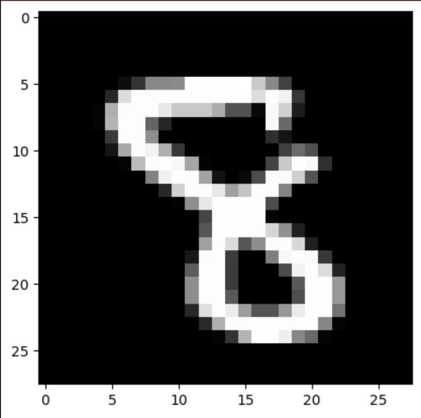

# Adam Optimization
Neural network from scratch using adam optimization 

## Algorithm

### while $\theta_t$ NOT converge do:
	t + 1
	gradients w.r.t cost at timestep t
	update first estimate (momentum)
	update second momentum estimate (RMSprop)
	compute bias-corrected first moment
	compute bias_corrected second moment
	update parameters

### Equations
$$ g_t = \delta f_t(\theta_{t-1}) $$

$$ m_t = \beta_1 *m_{t-1} + (1-\beta_1) *g_t $$

$$ v_t = \beta_2*v_{t-1} + (1-\beta_2)*g^2_t $$

$$ \hat{m}_t = m_t/(1-\beta_1^t) $$

$$ \hat{v}_t = v_t/(1-\beta^t_2) $$

$$ \theta_t=\theta_{t-1}-\alpha*\frac{\hat{m}_t}{\sqrt{\hat{v}_t}+\epsilon} $$

### Why it works

### 

1. When gradients are close to zero for a long time, and suddenly there is a large gradient, adam optimization makes an adjustment to the step size to make sure the large gradient doesn’t cause a huge jump.
2. In common cases, the ratio $\frac{\hat{m}_t}{\sqrt{\hat{v}_t}+\epsilon}$ is about + or - 1. This means that the step size is always going to be capped by the alpha value (learning rate), so that the steps can’t explode in size.
3.  This capped alpha value provides a trust zone for the model. The alpha and SNR set the radius of the trust region, so that you never take steps to big that you leave the region where your gradient is trustworthy.  
4. The SNR (Signal to Noise) ratio tells the model how reliable the gradient step is. A high SNR means the gradient direction is reliable. A low SNR means there is more uncertainty in that direction. Near the optimum point, gradients are noisier (low SNR), so Adam automatically takes smaller steps.
5. If you scale your gradients by a factor of ‘c’, the SNR ratio will cancel it out. This shows that Adam’s step size is not effected by the scale of the gradients.
